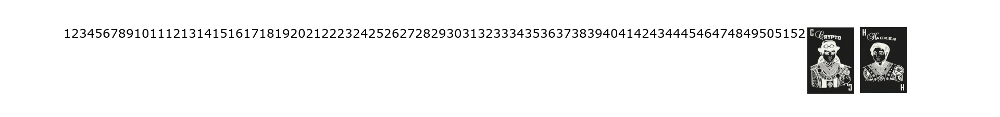
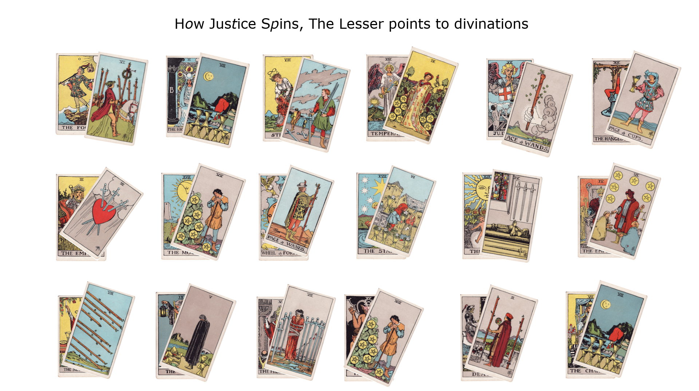
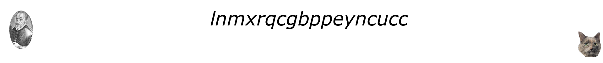
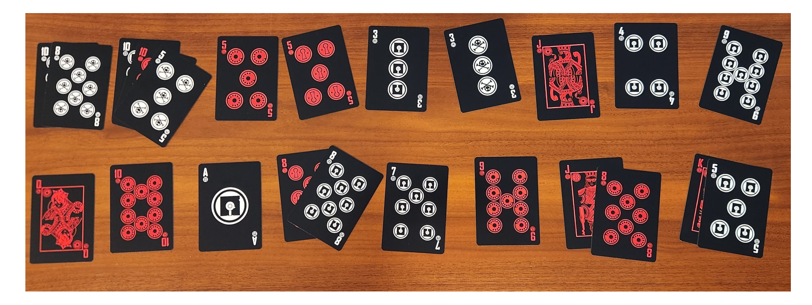

## Trailhead
The trail starts with the shirt. EFF posted a picture of it online: [EFF at the Las Vegas Hacker Conferences](https://www.eff.org/deeplinks/2024/07/eff-las-vegas-hacker-conferences), for those who don't have one. The actual shirt includes glow-in-the-dark elements, but they're not significant this year.

They also had this to say:
> This year’s DEF CON member t-shirt is inspired by the 11th card of the tarot. The path to Justice will lead you to this year’s puzzle challenge

Given the prominent rivets on the armor and the slash-shaped plates, I spend a lot of time trying to build something out of that, but the key observation is actually the dots in "T A R.O.T." and "XI". "ROT" here refers to the infamous [Caesar cipher](https://en.wikipedia.org/wiki/Caesar_cipher), specifically with a rotation of 11.

The "path to justice" is then "https://www.eff.org/justice", but rotated to [https://www.eff.org/ufdetnp](https://www.eff.org/ufdetnp).

That URL forwards to [https://elegin.com/images/waterhouse.png](https://elegin.com/images/waterhouse.png), which I'm splitting into chunks and including per section. I've also replaced the transparent background with white, which works better with the dark background.

## Waterhouse

First of all, the name of the image is "Waterhouse.png", which is a reference to a character in [Neal Stephenson's Cryptonomicon](http://www.nealstephenson.com/cryptonomicon.html). This is a hint that the puzzle will use the [Solitare Cipher](https://en.m.wikipedia.org/wiki/Solitaire_(cipher)) introduced in that book.

At the top of the image is the numbers 1..52 squashed together without spaces, followed by what look like a pair of playing cards. Specifically, the "Crypto" and "Hacker" jokers from a deck given out at DC21 in 2013. They can be seen in the splash image of this WIRED article: [Hidden Circuits and Handmade Clockwork: The Striking Intricacies of Def Con Badges](https://www.wired.com/2013/08/defcon-badges-revealed/). This is the default key of the Solitaire cipher, both reinforcing the above, and giving us enough information to actually use it. Later.

## Tarot Cards

There are 18 pairs of Tarot cards, from the traditional Rider–Waite deck, one atop the other, the upper slightly rotated. The lower card is always a Major Arcana, while the upper is always Minor. It has the caption "H*o*w Jus*t*ice S*p*ins, The Lesser points to divinations". The letters "otp" are italicised.

In this part, "divinations" means the names of the Major Arcana, and "The Lesser points" means we use the value of the Minor as an index into the major. "How Justice Spins" references the trailhead, as the text has also been Caesared by 11. I do not know why OTP was referenced.

(Aside: in puzzling, OTP refers to the [One-time pad](https://en.wikipedia.org/wiki/One-time_pad))

- Major_name[Minor_value]: `opncjaentaspceoiei`
- And ROT -11: `decryptciphertextx`

This clear text output is very convenient, and lets us know we are on the right path. Something that we won't see again this puzzle, so savor it for now.

## Blaise de Vigenere

The third block consists of a portrait of Blaise de Vigenere, the letters "lnmxrqcgbppeyncucc", and a picture of a cat (slightly lower). In puzzles, any reference to Mr. Vigenere means to used the cipher he popularized and improved upon with his Autokey cipher. In this case, what we need to do is to take the given lnmx... ciphertext and decrypt it with the Vigenere key "decryptciphertextx", to get the following string:

- Vigenere Plaintext: `ijkgtbjetaiahuyxjf`

The big hint that we're doing the right thing here is that the length of the key from the Tarot cards and the length of the Vigenere string are both 18, while the next section is going to give a length 17 string. It makes no sense to provide a length 18 key for a length 17 ciphertext, and the reverse is very unusual. (In actual practice, one would expect the Vigenere key to be substantially shorter than the ciphertext, but that's because one would expect a plaintext long enough to contain a useful message.)

## Playing Cards

The fourth and final block consists of 17 stacks of playing cards from the DEF CON deck mentioned in the first section. Each stack has 1..3 cards, with a sum in the range of 1..25, assuming Ace is 1 and all face cards are worth 10 (aka, Blackjack scoring). Given a series of numbers in the range 1..26, we immediately reach for our old friend A1B2 (aka A1Z26 or "Letter Numbers"), which decodes the stacks as follows:

- Playing Cards: `ryeecckdiljapgisr`

Again, we have little evidence this decryption is correct, but we have to go with it for now. In practice, I was building up a significant set of possible decryptions, testing them all in parallel.

## Finale
As mentioned in the first section, we are going to use the Solitaire cipher. I personally used the implementation by [dcode.fr](https://www.dcode.fr/solitaire-cipher-schneier). The ciphertext is derived by concatenating the output of the Vigenere cipher and the playing cards, as suggested by the cat picture. The key is simply the numbers 1..52,A,B as suggested by the numbers at the top of the image.

From the Vigenere section, we don't actually know which of the Tarot-string and the Vigenere-string is the key or the text, nor whether the text is plain or cipher, so there are three output strings we need to test. Fortunately, that's not too many. More importantly, Solitaire is a stream cipher, so we can test the first half and the playing-cards half independently.

- Ciphertext: `ijkgtbjetaiahuyxjfryeecckdiljapgisr`
- Plaintext: `emailcryptonomicontoeffdcatprotonme`

This gives us an email address, a keyword, and concludes the puzzle. Thanks for reading.

