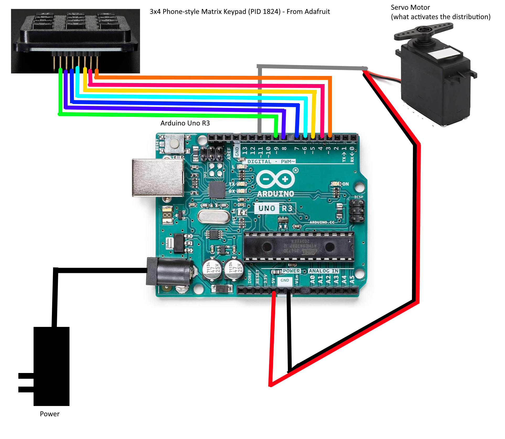

At one of the tables, there was a gumball machine full of flags. But it didn't take coins, it took a code, entered with a numeric keypad.

We were given the firmware: [machine.ino.standard.hex](machine.ino.standard.hex), and a schematic:


## Reverse Engineering
First things first, we open the firmware.hex in IDA. However, IDA cannot detect binary types with .hex files. From the provided diagram, we know it's an Arduino UNO R3, which uses an ATMEL ATMEGA328P.

For IDA "Atmel AVR" and "ATmega16_L" is enough. However, you can get a more accurate .cfg file from [github:SilverBut/avr_helper](https://github.com/SilverBut/avr_helper).

Skimming the binary, we notice the following basic facts:
- There are a bunch of suspicious constants at ``ROM:0035``, and ``ROM:06D3``
- There is a function at ``loc_5C4`` that isn't recognized. That means nothing is seen to be invoking it. That's odd in a binary this small.

Important Note: IDA counts ROM offsets in 16-bit words. Nothing else does. Consider the following disassembly.
```asm
ROM:0069 E0A0                      ldi     XL, 0           ; Load Immediate
ROM:006A E0B1                      ldi     XH, 1           ; Load Immediate
ROM:006B EAE6                      ldi     ZL, 0xA6        ; Load Immediate
ROM:006C E0FD                      ldi     ZH, 0xD         ; Load Immediate
ROM:006D C002                      rjmp    loc_70          ; Relative Jump
ROM:006E           ; ---------------------------------------------------------------------------
ROM:006E
ROM:006E           loc_6E:                                 ; CODE XREF: __RESET+10↓j
ROM:006E 9005                      lpm     r0, Z+          ; Load Program Memory
ROM:006F 920D                      st      X+, r0          ; Store Indirect
```

Note how the addresses at the left are only going up by 1 per line, but there are clearly two bytes per line. All the registers on this chip are 8-bit, and all instructions are 16-bit. Therefore, it takes two instructions to load a 16-bit address into a pair of registers. The first two pairs of lines do `X:=0x100`, and `Z:=0xDA6`. Now, Z is used to load **program** memory, that means ROM, so while the chip and GDB call this 0xDA6, IDA calls it `ROM:06D3`. On the other hand, when it's written to the address in X, it goes to `RAM:0100`. No translation necessary.

So, summary of _RESET:
- .rwdata is 38 bytes, comes from ``ROM:06D3``, and goes to ``RAM:0100``
- .bss is 172 bytes, and starts at ``RAM:0126``
- init() is at ``ROM:0061`` and invokes ``sub_5C4``
- main() is ``sub_376``

Main is unfortunately both large and complicated. However, there are a couple hints as to the right place to look. First, there's this suspicious disassembly. The keypad has '*' and '#' buttons:
```asm
ROM:0559 3223                      cpi     r18, 0x23 ; '#' ; Compare with Immediate
ROM:055A F019                      breq    loc_55E         ; Branch if Equal
ROM:055B 322A                      cpi     r18, 0x2A ; '*' ; Compare with Immediate
ROM:055C F009                      breq    loc_55E         ; Branch if Equal
```

Second, there's the two strings at the end of ROM, this is the second set of "suspicious constants" mentioned above. (easiest to show in gdb, but just as visible in IDA):
```bash
(gdb) x/s 0xDA6 + 0x7
0xdad:  "123456789*0#"
(gdb) x/s 0xDA6 + 0x1D
0xdc3:  "734 52912"
```

The second of those looks a lot like an unlock code, of course it doesn't work. However, the code is part of the block that gets copied to RAM, with a base of 0x100 and an offset of 0x1D. There are no XREFs to either, which suggests that it's accessed by pointer (unsurprising, since it's a string). With a binary this small, IDA Text search for "0x1D" will find where it's used. (On a better supported Assembly, IDA would be able to detect these multi-instruction address loads.)
```asm
ROM:055E E16D                      ldi     r22, 0x1D       ; Load Immediate
ROM:055F E071                      ldi     r23, 1          ; Load Immediate
ROM:0560 E28D                      ldi     r24, 0x2D ; '-' ; Load Immediate
ROM:0561 E091                      ldi     r25, 1          ; Load Immediate
ROM:0562 940E 06C8                 call    sub_6C8         ; Call Subroutine
ROM:0564 2B89                      or      r24, r25        ; Logical OR
ROM:0565 F599                      brne    loc_599         ; Branch if Not Equal
```
It's not hard to guess what sub_6C8 is going to do with two pointers, but a little reversing confirms that it is ``strcmp()``. Next would be finding out where and how ``RAM:0012D`` is populated, but that's hard. (The challenge creator later mentioned he used a standard library for this, which explains the complexity of the code that reads pins and converts the button to ASCII.)

## Keypads
A brief aside on keypads:

Keypads are passive. They don't have chips or logic or anything. They don't even have power rails. It's a 3x4 grid of wires connected by membrane keyswitches. In this case the designer put pull-up resistors on the rows. The way the code checks if a button is pushed is by setting a column put to "output" and "low", and checking the row pins to see if any of them got pulled low. This is hard to fake in GDB. If you just pull a row low, then when the code polls the first column it will see the low value and read that the corresponding button in the first column is pressed. There's no easy way to simulate other column buttons.

## Simulators
My first choice for simulating AVR binaries is [simavr](https://github.com/buserror/simavr). However, I don't know how to simulate peripherals with it.

There's a nice emulator at [wowki](wokwi.com), which supports either source or .hex, and peripherals, and debugging, but not debugging of .hex; otherwise it's great.

The one that did all three is [PICSIMLab](https://github.com/lcgamboa/picsim). Steps:
- File -> Load Hex -> machine.ino.standard.hex
- File -> Configure -> AVR DBG: GDB
- MHz:16
- Modules -> Spare Parts -> Input:"Keypad" and Output:"Servo Motor"
    - click somewhere to spawn them
    - right-click -> properties -> set the pin connections.
- Debug

Having done that, gdb-avr can connect to the running simulation and remote debug it. You need to use a Windows Native gdb-avr, Atmel Studio includes one in the installer. Supposedly you can also download it directly from [Microchip](https://www.microchip.com).

## Dynamic Analysis
Based on the above, we want two breakpoints:
- IDA:54D -- right after ``lds r18, loc_100158`` where the pressed key is checked
- IDA:562 -- right before ``strcmp(input, code)``

The following gdbinit file will create those breakpoints with command blocks to print out the interesting values and continue processing. Note the `*2` to convert IDA word-offsets into GDB byte-offsets and the casting to function pointers to tell GDB to set the breakpoint in ROM (otherwise it will uselessly set them in RAM).

```bash
# setup
set pagination off
target remote:1234

# display keypresses
break *(void(*)())(0x54d*2)
commands
    p/x $r18
    continue
end

# display code length and buffer
break *(void(*)())(0x562*2)
commands
    x/xb 0x136
    x/s 0x12d
    continue
end
```

At this point we can push buttons on the gui and see how things work out. For example the sequence "258#" gives this output:
```bash
Breakpoint 1, 0x00000a9a in ?? ()
$1 = 0x32

Breakpoint 1, 0x00000a9a in ?? ()
$2 = 0x35

Breakpoint 1, 0x00000a9a in ?? ()
$3 = 0x36

Breakpoint 1, 0x00000a9a in ?? ()
$4 = 0x23

Breakpoint 2, 0x00000ac4 in ?? ()
0x800136:       0x03
0x80012d:       "256"
```

And the sequence "12345678901#" gives output that ends with
```bash
Breakpoint 2, 0x00000ac4 in ?? ()
0x800136:       0x0b
0x80012d:       "90145678"
```

## Results
At this point everything is clear. We need to hit 11 numeric buttons to get RAM:136 up to 0xb, and the keys are stored in an 8-byte ring buffer, so the first three numbers we enter will be overwritten by the last three. With this in hand, we can enter the code "00052912734#" and claim our tasty gumball.



After the CTF was over, the challenge creator also provided the [Candy Machine Source INO](candy-machine.ino).
