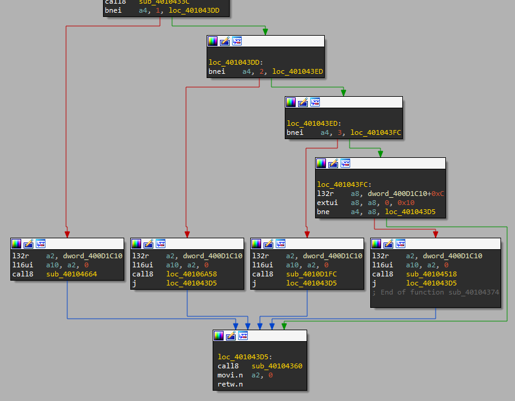

## Basics
The NorthSec 2023 CTF (Tie) Badge is an Xtensa ESP32 based system. How to reverse that is covered in [the Intro](../challenge_led-0/).

When we connect to the serial console of the badge, we see the following:
```sh
[0](Ghroth)❯ miniterm.py -f direct /dev/ttyUSB0 115200
--- Miniterm on /dev/ttyUSB0  115200,8,N,1 ---
--- Quit: Ctrl+] | Menu: Ctrl+T | Help: Ctrl+T followed by Ctrl+H ---

nsec> help
...
challenge_led  [1-3]
  Run the LED pattern for the challenges 1,2,3
int16 second param: ms delay
...
```

## Strings
Since we know some strings associated with the challenge, we search for them in IDA:
```sh
.flash.rodata:3F40C78A	0000002F	C	./components/challenges_led/challenges_led.cpp
.flash.rodata:3F40C7C7	0000004C	C	Run the LED pattern for the challenges 1,2,3\n  int16 second param: ms delay
.flash.rodata:3F40C719	00000033	C	\x1B[0;32mI (%lu) %s: Running LED challenge %d!\n\x1B[0m\n
.flash.rodata:3F40C7B9	0000000E	C	challenge_led
.flash.rodata:3F40C70A	0000000F	C	challenges_led
.flash.rodata:3F40C76B	0000001F	C	void register_challenges_led()
```

All these string are in roughly the same place in memory. Here's a somewhat trimmed copy of that.
```sh
.flash.rodata:3F40C6F0 off_3F40C6F0    .int aChallengeLed      ; DATA XREF: .flash.text:off_400D1C30↓o
.flash.rodata:3F40C6F4                 .int aRunTheLedPatte    ; "Run the LED pattern for the challenges"
.flash.rodata:3F40C6F8                 .int a13                ; "[1-3]"
.flash.rodata:3F40C6FC                 .int sub_40104374
.flash.rodata:3F40C700                 .int 0
.flash.rodata:3F40C704 a31337          .ascii "31337",0        ; DATA XREF: .flash.text:off_400D1C0C↓o
.flash.rodata:3F40C70A aChallengesLed  .ascii "challenges_led",0
.flash.rodata:3F40C719 a032miLuSRunnin .ascii "1B[0;32mI (%lu) %s: Running LED challenge %d!1B[0m",0
.flash.rodata:3F40C74C aEspConsoleCmdR .ascii "esp_console_cmd_register(&cmd)",0
.flash.rodata:3F40C76B aVoidRegisterCh .ascii "void register_challenges_led()",0
.flash.rodata:3F40C78A aComponentsChal .ascii "./components/challenges_led/challenges_led.cpp",0
.flash.rodata:3F40C7B9 aChallengeLed   .ascii "challenge_led",0
.flash.rodata:3F40C7C7 aRunTheLedPatte .ascii "Run the LED pattern for the challenges 1,2,3\n"...
.flash.rodata:3F40C813 a13             .ascii "[1-3]",0        ; DATA XREF: .flash.rodata:3F40C6F8↑o
.flash.rodata:3F40C819 byte_3F40C819   .byte    2,   3,   5,   9, 0xC, 0xD, 0xF,0x16,0x1E,0x21,0x25,0x28,0x29,0x31,0x33,0x34,0x38,0x3B,0x3E,0x3F,0x41,0x42,0x43,0x44,0x46,0x47,0x48,0x49,0x4B,0x4E,0x50,0x56,0x57,0x59,0x5A,0x5B,0x5C,0x5E,0x5F,0x60,0x61,0x65,0x6C,0x6F,0x70
```

## Disassembly
The XRefs lead two places: `sub_40104414` and `sub_40104374`, the second of which is also the target of a forward pointer above. The first of the two is pretty boring, and includes a block of string references that look like error reporting code for a function named `void register_challenges_led()`. That's interesting but not what we want.

The second function, on the other hand, looks great. Especially the group at the bottom, which is pretty clearly a if-elseif-else block checking if something is 1, 2, 3, or 31337. (That last one is especially interesting...)


Now there are four functions of interest, the first of which is the subject of the remainder of this post.

## challenge_led 1 -- Actual
This function is large, but it's also very linear. The main sequence is mostly composed of the following five lines repeated many times:
```asm
mov.n   a10, a4
l32r    a8, off_400D1C08 ; -> sub_40093FC0
callx8  a8
mov.n   a10, a3
call8   sub_40104624 ; or sub_401045D4
```
Which of `sub_40104624` or `sub_401045D4` is called seems like noise. Or like signal.

There are also blocks that look like this, which don't seem as interesting:
```asm
movi.n  a10, 0xA
call8   sub_40104648
mull    a10, a10, a2
muluh   a10, a10, a5
srli    a10, a10, 3
l32r    a8, off_400D1C08
callx8  a8
mov.n   a10, a3
call8   sub_40104624 ; or sub_401045D4
```

Now, we could analyze this code in-depth, but it's going to be a mix of LED library code and Timer library code, which will be a right pain, or we can just guess that `off_400D1C08` resolves to a delay and `sub_40104624`/`sub_401045D4` resolve to sending 1 or 0, but we don't know which.

At this point my teammates know what's next: **Ruby**!

## Ruby
The plan here is simple:
1. Copy the entire function disassembly into the clipboard
2. Paste that into a text file
3. Read that file into ruby
4. Text-Process it there

And next, the text-processing in more detail. This is not something that happens all at once, more like an iterative process, slowly teasing meaning out of the signal. However, knowing how to recognize UART, SPI, and I2C will come in very handy in challenges like this. Overview:
1. Read the file in, split into lines, and remove newlines.
2. Discard all lines that don't call one of the two subroutines.
3. Count how many subs we see.
4. Convert the subs into bits, guessing (correctly) that `sub_401045D4` is 1.
5. After a few tries, figure out what slice width gives regular output. In this case, 14. These are UART frames. Consider the first frame:
    - `10` is the start of frame
    - `01100010` is data
    - `1` is the parity bit (even)
    - `111` is idle.
    - (often you'll jump in mid-packet, and have to drop some bits at the start to get things to line up well.)
6. Extract data bits 2..8, reverse them, and convert to ASCII characters.

```ruby
[1] pry(main)> lines = File.read('challenge_1.txt').lines.map(&:chomp);
[2] pry(main)> subs = lines.select{|line| line=~/call8 *sub_40104(5D4|624)/};
[3] pry(main)> subs.length
=> 294
[4] pry(main)> bits = subs.map{|line| line=~/5D4/ ? 1 : 0}.join
=> "100110001011111000110010111110100000100111101110001001111010110100011110101100100111100100110011111000100010011110001011001111100001001001111001011010011110010110100111101000101011111011110010111110011010100111101111001011111011101010111110111010101111101101001001111010010010111110110000101111"
[5] pry(main)> bits.scan(/.{14}/)
=> ["10011000101111",
    "10001100101111",
    "10100000100111",
    "10111000100111",
    "10101101000111",
    "10101100100111",
    "10010011001111",
    "10001000100111",
    "10001011001111",
    "10000100100111",
    "10010110100111",
    "10010110100111",
    "10100010101111",
    "10111100101111",
    "10011010100111",
    "10111100101111",
    "10111010101111",
    "10111010101111",
    "10110100100111",
    "10100100101111",
    "10110000101111"]
[6] pry(main)> bits.scan(/.{14}/).map{|packet| packet[2,8].reverse.to_i(2).chr }.join
=> "FLAG-M2D4HZZQOVOWWKIC"
```

