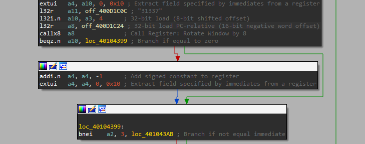

## Basics and Access
The NorthSec 2023 CTF (Tie) Badge is an Xtensa ESP32 based system. How to reverse that is covered in [the Intro](../challenge_led-0/).

How to find the function of interest is covered in [challenge_led 1](../challenge_led-1/).

In that, we noted the existence of a fourth challenge function, which is accessible if the challenge selected is `31337`. However, I may have neglected to mention this:

Recall that our challenge choice is decoded into `a4`, so if we enter "31337", then `a4` will be set to 31336 and the  challenge won't start. Now, there are two ways to deal with this. First, we could reflash the chip to bypass the check, but then we'd have to deal with checksums and such. Second, we could notice the top instruction in the screenshot above:
```asm
extui   a4, a10, 0, 0x10 ; Extract field specified by immediates from a register
```
"Extract Unsigned Immediate". Roughly `a4 := (a10<<0) & ((1<<0x10)-1)`. Which is to say, it's a 16-bit copy. Only the low 16 bits of our input are considered, so 31337+65536 = 96873 is also a valid challenge_id ID.

## Initial Observations
Running the challenge and looking at the LEDs with our eyes, we can note some basic facts:
- Four corners light up blue, LEDs 1,2,11,12 (u6,u7,u16,u17).
- Need to provide a delay, the default delay appears to be 0.
- The intervening LEDs turn purple and pulse cyan in a pattern that is clearly not ASCII.
- Seemed like ~21 pulses.

## Disassembly
This challenge is not like the other ones. It isn't a long linear function. Mostly a loop. A loop that looks pretty simple. It does some basic setup, mostly involving what appear to be delay functions. Then we see this nonsense:
```asm
.flash.text:40104581      l32r    a2, sub_400D1C6C
.flash.text:40104584      mov.n   a10, a1
.flash.text:40104586      s32i.n  a2, a1, 0
.flash.text:40104588      l32r    a2, off_400D1C5C
.flash.text:4010458B      mov.n   a11, a2
.flash.text:4010458D      call8   sub_400D49C4
```
Best as I can interpret it, `a1` is used as the stack pointer, so it would decompile like this:
```c
    a10 = $rsp
    $rsp[0] = &sub_400D1C6C;
    sub_400D49C4($rsp, off_400D1C5C
```

Decompiling the relevant parts of the whole function looks like this. Note the tricks being pulled here. `off_400D1C5C` is a global that's holding our loop counter, so the counter isn't modified at all in this function. It seems like a linked list iterator or similar from how `sub_4014C850` evaluates.
```c
void challenge_led_31337_40104518() {
    // all kinds of setup, delays, etc.
    a2 = off_400D1C5C
    a3 = 180*1000;
    // ...
    $rsp[0] = &sub_400D1C6C;
    a10 = sub_400D49C4($rsp, a2)
    a8 = *a3;
    sub_40083100(a10, a2, a8*280, sign_bit(a8*280))
    a3 = 50;
    while(true) {
        a10 = sub_4014C850(*a2);
        if (a10==0) break;
        sub_4008D734(); // probably random delay
        sub_4008D734();
        vTaskDelay_40093FC0(a3);
    }
}
```

## Disassembly 2
If `off_400D1C5C` is a global loop counter, then `sub_400D1C6C` becomes our candidate of interest. It's also being dealt with weirdly, but more importantly, it holds the other XRef to `off_400D1C5C`. The prologue is also **VERY** interesting:
```c
void sub_400D1C6C() {
    a2 = *off_400D1C58;
    a12 = *off_400D1C48;
    a13 = [ 0x62, 0x32, 0x82, 0xE2, 0xB4, 0x5A, 0x9C, 0xCA, 0x8A, 0x62, 0xA, 0x62, 0x42, 0xCC, 0xA, 0xAC, 0x2C, 0x9A, 0xC, 0x42, 0x2C];
    a14 = 0x66CDAA; // medium aquamarine
    a15 = 0xC71585; // medium violet red
```
From here is does a weird `LOOP` construct that IDA doesn't handle well, but seems to be building an array of 8 color triplets based on the bits of `a13[a2]`... Yeah, spoilers, a13 is the flag.

Exactly what's happening with the rest of the function is hard to tell without a lot more work. There's more evidence of some linked-list functions, and a bunch of library functions related to delays and probably LEDs. But at this point, it's time to shift to decoding the flag.

## Ruby
```ruby
[0](Ghroth)❯ pry
[1] pry(main)> a13 = [ 0x62, 0x32, 0x82, 0xE2, 0xB4, 0x5A, 0x9C, 0xCA, 0x8A, 0x62, 0xA, 0x62, 0x42, 0xCC, 0xA, 0xAC, 0x2C, 0x9A, 0xC, 0x42, 0x2C]
=> [98, 50, 130, 226, 180, 90, 156, 202, 138, 98, 10, 98, 66, 204, 10, 172, 44, 154, 12, 66, 44]
[2] pry(main)> a13.map{|x| '%08b'%[x]}
=> ["01100010",
    "00110010",
    "10000010",
    "11100010",
    "10110100",
    ...
]
[3] pry(main)> a13.map{|x| '%08b'%[x]}.map{|x| x.reverse.to_i(2).chr}.join
=> "FLAG-Z9SQFPFB3P54Y0B4"
```

Just looking at it in binary is enough to see what's going on. Printable ASCII bytes always a high-bit of 0, and at least one bit of the two second-highest bits 1. The bytes are just bit-reversed. This is trivial to fix and gets the flag.

