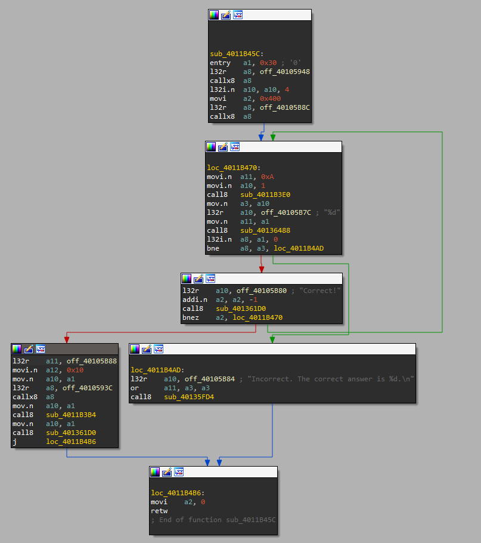

## Introduction
The NorthSec 2023 CTF (Tie) Badge is an Xtensa ESP32 based system. How to reverse that is covered in [the Intro](../challenge_led-0/).

When we connect to the serial console of the badge, we see the following (trimmed to fit):
```
:::.    :::.    ...    :::::::.. :::::::::::: ::   .:  .::::::..,::::::   .,-:::::
`;;;;,  `;;; .;;;;;;;. ;;;;``;;;;;;;;;;;;'''',;;   ;;,;;;`    `;;;;'''' ,;;;'````'  
  [[[[[. '[[,[[     \[[,[[[,/[[['     [[    ,[[[,,,[[['[==/[[[[,[[cccc  [[[         
  $$$ "Y$c$$$$$,     $$$$$$$$$c       $$    "$$$"""$$$  '''    $$$""""  $$$         
  888    Y88"888,_ _,88P888b "88bo,   88,    888   "88o88b    dP888oo,__`88bo,__,o, 
  MMM     YM  "YMMMMMP" MMMM   "W"    MMM    MMM    YMM "YMmMY" """"YUMMM "YUMMMMMP"
nsec> help
<...>
math
  Practice math!
<...>
[0](Ghroth)❯ miniterm.py -f direct /dev/ttyUSB0 115200
nsec> math
9 - 4 = 5
Correct!
3 - 2 = 1
Correct!
2 + 2 = 77
Incorrect. The correct answer is 4.
nsec>
```

## Strings
IDA has a string search function, and we have a bunch of strings to search for:
```asm
seg000:3F41D3A1	0000000B	C	%d + %d =
seg000:3F41D3AC	0000000B	C	%d - %d =
seg000:3F41D3B7	0000000B	C	%d * %d =
seg000:3F41D3C2	00000009	C	Correct!
seg000:3F41D3CB	00000026	C	Incorrect. The correct answer is %d.\n
seg000:3F41D3F7	0000000A	C	{;'\b|!~:k
seg000:3F41D406	0000000F	C	Practice math!
seg000:3F41D415	00000015	C	void register_math()
seg000:3F41D42A	00000023	C	./components/cmd_math/cmd_math.cpp
```

Which leads us to
```asm
.rodata:3F40D3A1 aDD             .ascii "%d + %d = ",0   ; DATA XREF: .flash.text:40105B68↓o
.rodata:3F40D3AC aDD_0           .ascii "%d - %d = ",0   ; DATA XREF: .flash.text:40105B6C↓o
.rodata:3F40D3B7 aDD_1           .ascii "%d * %d = ",0   ; DATA XREF: .flash.text:40105B70↓o
.rodata:3F40D3C2 aCorrect        .ascii "Correct!",0     ; DATA XREF: .flash.text:40105B80↓o
.rodata:3F40D3CB aIncorrectTheCo .ascii "Incorrect. The correct answer is %d.\n",0
.rodata:3F40D3CB                                         ; DATA XREF: .flash.text:40105B84↓o
.rodata:3F40D3F1 byte_3F40D3F1   .byte  9, 3, 0xE, 8, 0x62, 2, 0x7B, 0x3B,
                                        0x27, 8, 0x7C, 0x21, 0x7E, 0x3A, 0x6B, 0
.rodata:3F40D3F1                                         ; DATA XREF: .flash.text:40105B88↓o
.rodata:3F40D401 aMath           .ascii "math",0         ; DATA XREF: .flash.text:40105B90↓o
.rodata:3F40D406 aPracticeMath   .ascii "Practice math!" ; DATA XREF: .flash.text:40105B94↓o
```

## XOR
That byte stream in the middle is mighty suspicious...
```ruby
[0](Ghroth)❯ pry
[1] pry(main)> sus = '9, 3, 0xE, 8, 0x62, 2, 0x7B, 0x3B, 0x27, 8, 0x7C, 0x21, 0x7E, 0x3A, 0x6B'
=> "9, 3, 0xE, 8, 0x62, 2, 0x7B, 0x3B, 0x27, 8, 0x7C, 0x21, 0x7E, 0x3A, 0x6B"
[2] pry(main)> sus = sus.split(', ').map{|s|s.to_i(16)}
=> [9, 3, 14, 8, 98, 2, 123, 59, 39, 8, 124, 33, 126, 58, 107, 0]
[3] pry(main)> 'FLAG-'.bytes.zip(sus).map{|a,b|a^b}
=> [79, 79, 79, 79, 79]
[4] pry(main)> sus.map{|x|(x^79).chr}.join
=> "FLAG-M4thG3n1u$O"
```

That was too easy. Let's try to do it The Hard Way™.

## Disassembly
We can chase the string XRefs back to a function easily enough:

A couple things stick out immediately:
- There's a loop, it runs `a3=sub_40136488(1)`, and `a8=sub_40136488("%d",d11)`
- If `a8 != a3`, it prints "Incorrect...", and the function returns.
- If `a8 == a3`, it prints "Correct", and decrements `a2`
- `a2` is initialized to 1024.
- That's _way_ more times than we want to do it manually.

Slightly deeper analysis reveals that on success:
- We load `off_40105B88` -> `byte_3F40D3F1` (the flag array above)
- We pass that to `off_4010593C` -> `sub_4000C2C8`
- And to `sub_4011B3B4`, which is a xor decoder loop
- And to `sub_401361D0`, which is used above to print "Correct!", so probably `puts()`
- (in case you wanted another path to find the flag array)

## Exploit
So, we're doing this The Hard Way™. And The Hard Way™ is to patch the program.

Enabling "Options->Genera->opcode bytes = 4", shows us this:
```asm
.flash.text:4011B467 22 A4 00                    movi    a2, 0x400
```
From the ISA, we know that the immediate here is the final 12 bits, so we can patch that to
```asm
.flash.text:4011B467 22 A0 01                    movi    a2, 1
```

And it's off to the races!
```sh
[0](Ghroth)❯ esptool.py --chip esp32 --baud 2000000 write_flash 0x0 patched.bin
esptool.py v4.5.1
Serial port /dev/ttyUSB0
Connecting.....
Chip is ESP32-D0WDQ6 (revision v1.0)
Features: WiFi, BT, Dual Core, 240MHz, VRef calibration in efuse, Coding Scheme None
Crystal is 40MHz
MAC: c8:f0:9e:b1:82:78
Uploading stub...
Running stub...
Stub running...
Changing baud rate to 2000000
Changed.
Configuring flash size...
Flash will be erased from 0x00000000 to 0x003fffff...
Compressed 4194304 bytes to 1381652...
Wrote 4194304 bytes (1381652 compressed) at 0x00000000 in 27.4 seconds (effective 1226.3 kbit/s)...
Hash of data verified.

Leaving...
Hard resetting via RTS pin...
```

Great! But...
## Checksums
```sh
E (346) esp_image: Checksum failed. Calculated 0x63 read 0x66
E (347) boot: Factory app partition is not bootable
E (347) boot: No bootable app partitions in the partition table
```

Oh No! There's checksums! Of course there are, and they're a good thing, but we need to fix them. Fortunately, they tell us what it is and what it should be, but it doesn't tell us where it is. I actually found the right one by changing all the nearby `66`s to unique hex values and trying again. The right one is at 0x7b930:

```sh
E (346) esp_image: Image hash failed - image is corrupt
E (347) boot: Factory app partition is not bootable
E (347) boot: No bootable app partitions in the partition table
```

Oh No! The image is corrupt, and this time it doesn't give details. We need `esptool.py image_info`, but that doesn't work on firmware dumps, it works on partitions. We need to slice it up. I found [tenable / esp32_image_parser](https://github.com/tenable/esp32_image_parser), which is somewhat old and had some problems, but was able to dump the partition table for me. That reports the `factory` partition at `0x10000`. Now to see what it contains:

```sh
[0](Ghroth)❯ dd if=patched.bin of=image.bin iflag=skip_bytes skip=$((0x10000))
8064+0 records in
8064+0 records out
4128768 bytes (4.1 MB, 3.9 MiB) copied, 0.0313044 s, 132 MB/s

[0](Ghroth)❯ esptool.py --chip esp32 image_info p2.bin
esptool.py v4.5.1
Image version: 1
Entry point: 400814b4
5 segments

Segment 1: len 0x1e0e0 load 0x3f400020 file_offs 0x00000018 [DROM]
Segment 2: len 0x01f10 load 0x3ffbdb60 file_offs 0x0001e100 [BYTE_ACCESSIBLE,DRAM]
Segment 3: len 0x80f38 load 0x400d0020 file_offs 0x00020018 [IROM]
Segment 4: len 0x0606c load 0x3ffbfa70 file_offs 0x000a0f58 [BYTE_ACCESSIBLE,DRAM]
Segment 5: len 0x180a8 load 0x40080000 file_offs 0x000a6fcc [IRAM]
Checksum: 66 (valid)
Validation Hash: d60370e14f3fae73c5f8b41b3c6758a85460d172e5b77b16788e5b990df9b43b (invalid)
```

And this is what we need to see. We can repeat the same procedure on the unmodified image to find the original checksum `be260f1ed5fab0d4f4d8a11cfbcbe98e351d6073092fce90d8734042638b9105`. With this, we can patch the SHA256:
```sh
[0](Ghroth)❯ grep -abo "$(echo be260f1ed5fab0d4f4d8a11cfbcbe98e351d6073092fce90d8734042638b9105 | xxd -ps -r)" patched.bin
848000:�&�����ء���5`s	/ΐ�s@Bc��

[0](Ghroth)❯ echo d60370e14f3fae73c5f8b41b3c6758a85460d172e5b77b16788e5b990df9b43b | xxd -ps -r | dd of=patched.bin seek=848000 bs=1
32+0 records in
32+0 records out
32 bytes copied, 0.000141329 s, 226 kB/s

[0](Ghroth)❯ esptool.py --chip esp32 --baud 2000000 write_flash 0x0 patched.bin
esptool.py v4.5.1
...
Wrote 848032 bytes (493810 compressed) at 0x00000000 in 7.2 seconds (effective 939.1 kbit/s)...
Hash of data verified.

[0](Ghroth)❯ miniterm.py -f direct /dev/ttyUSB0 115200
nsec>
nsec> math
5 * 10 = 50
Correct!
FLAG-M4thG3n1u$
```

